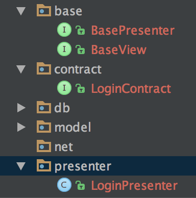

[](https://www.travis-ci.org/kong-jing/mvppy)
[](https://jitpack.io/#kong-jing/mvppy)


# mvppy
MVP demo from https://github.com/googlesamples/android-architecture



Add it in your root build.gradle at the end of repositories:
```
allprojects {
  repositories {	
    ...
    maven { url 'https://jitpack.io' }
    }
}
```

Add the dependency

```
dependencies {
  implementation 'com.github.kong-jing:mvppy:1.1.0'
  }
```
**问题**
```
* What went wrong:
A problem occurred evaluating project ':app'.
> Failed to apply plugin [id 'com.android.application']
``
在其他工程里面找到了4.1版本的gradle-wrapper.jar文件，在库工程的gradle\wrapper\目录下，并上传同步到GitHub，再次创建一次版本，成功通过。
版本号一定要带 v 开头
